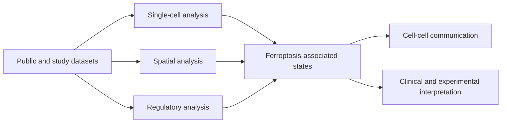

# Fer-in-GBM

Analysis code and data-access documentation for the manuscript:

> **Spatially resolved ferroptosis-associated states link mesenchymal-like, macrophage-rich niches to adverse clinical features in glioblastoma**

**Manuscript status:** submitted to *Briefings in Bioinformatics*.

## Overview

This study integrates single-cell RNA sequencing, spatial transcriptomics, single-nucleus chromatin accessibility, clinicogenomic analyses, and experimental validation to examine ferroptosis-associated heterogeneity in glioblastoma. The analyses characterize spatial associations among lower ferroptosis scores, mesenchymal-like malignant-cell states, and macrophage-rich niches, and evaluate GOT1-associated phenotypes and a retrospective ferroptosis-related prognostic score (FeSig).

The repository currently provides selected R analysis scripts together with an explicit record of available and missing inputs. Spatial co-localization and expression-score associations should not be interpreted, on their own, as direct measurements of ferroptosis or causal cell-cell interactions.

## Repository layout

| Path | Contents |
|---|---|
| [`scripts/`](scripts/) | Curated R scripts grouped by analysis domain |
| [`legacy/`](legacy/) | Unmodified original scripts retained for provenance |
| [`config/`](config/) | Example local path configuration and gene-set guidance |
| [`environment/`](environment/) | Package inventory and package-availability checker |
| [`docs/`](docs/) | GitHub Pages source |
| [`DATA.md`](DATA.md) | Dataset access, identifiers, and repository limitations |
| [`REPRODUCIBILITY_STATUS.md`](REPRODUCIBILITY_STATUS.md) | Module-level code and input coverage |

## Quick start

1. Install R and the packages used by the required analysis module.
2. Copy `config/paths.example.R` to an untracked local file such as `config/paths.local.R`, then replace the placeholders with your own data paths. This file is currently a configuration template; legacy-derived scripts do not yet source it uniformly.
3. Run `Rscript environment/check_packages.R` to identify missing packages.
4. Review [`DATA.md`](DATA.md) and [`REPRODUCIBILITY_STATUS.md`](REPRODUCIBILITY_STATUS.md) before running a script.
5. Execute individual scripts from the repository root after adapting their documented input paths and object names.

The scripts originate from exploratory analyses and are not yet a single-command workflow. Passing the automated syntax check does not establish end-to-end reproducibility or validate scientific outputs.

## Data and code availability

The archived study output currently available on Zenodo is:

- DOI: [10.5281/zenodo.18620722](https://doi.org/10.5281/zenodo.18620722)
- Record: [Zenodo record 18620722](https://zenodo.org/records/18620722)

The manuscript draft refers to accession `18620721`; this should be corrected to the public record `18620722` before publication. The current Zenodo record contains a processed snATAC-seq R object, not every dataset or source-data table used in the study. See [`DATA.md`](DATA.md) for a bounded availability statement and author actions.

## Reproducibility scope

The current release includes selected code for single-cell, spatial, regulatory, and CellChat analyses. It does **not** yet contain a complete executable workflow for snATAC-seq processing, FeSig construction and validation, genomic analyses, drug-response analyses, experimental statistics, or all figure source data. These limitations are itemized in [`REPRODUCIBILITY_STATUS.md`](REPRODUCIBILITY_STATUS.md).

## Citation

If you use this repository, please cite the software metadata in [`CITATION.cff`](CITATION.cff) and the associated manuscript when a final bibliographic record becomes available. Cite the archived data separately using its Zenodo DOI.

## License

Author-owned code in this repository is released under the [MIT License](LICENSE). Reused datasets and third-party material remain subject to their original terms and licenses; see [`NOTICE`](NOTICE), especially before reusing files under `legacy/`.

## Authors

Wenbo Zhao, Qingbei Lian, Yihang Yang, and Jianyang Du.
